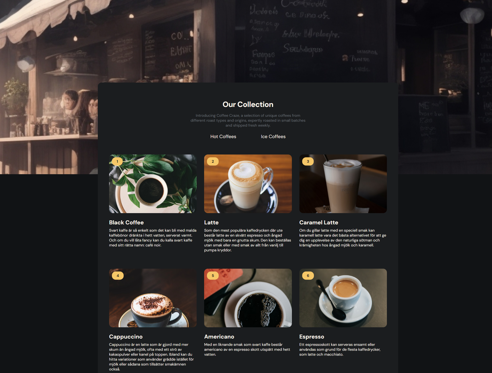
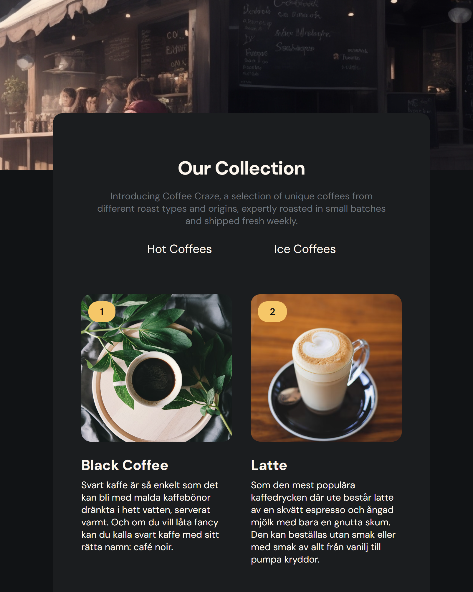
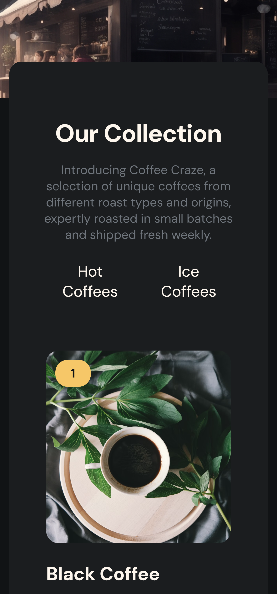

# CoffeeCraze

## Table of contents

- [Overview](#overview)
  - [Links](#links)
  - [The challenge](#the-challenge)
  - [Screenshot](#screenshot)
- [My process](#my-process)
  - [Built with](#built-with)
  - [Useful resources](#useful-resources)
- [Author](#author)

## Overview

### Links

- Solution URL: [CoffeeCraze Solution](https://github.com/ioangheraszim/CoffeeCraze)
- Live Site URL: [CoffeeCraze Live](https://ioangheraszim.github.io/CoffeeCraze)

### The challenge

Users should be able to:

- Create a coffee listing page that matches the given design. ✔️
- Use React or other Front-end libraries for this challenge. ✔️
- Create a Reusable Card component. ✔️
- The card component should include a picture, name, number, and description of coffee if exists. ✔️
- The card component should render number tag, availability status conditionally. ✔️
- Render Coffee list with given data. The data should come from a given API or downloaded JSON file. ✔️
- Users can choose to list hot coffee products or just ice coffee products. ✔️
- Deploy the solution ✔️

## Screenshot

- Desktop Screenshot

  

    
  

- Tablet and Mobile Screenshot
  

    
     
  

## My process

### Built with

- Semantic HTML5 markup
- Flexbox
- Grid
- Mobile-first workflow
- [React](https://reactjs.org/) - JS library

### Useful resources
- [Coffee API](https://sampleapis.com/api-list/coffee) - Coffee Basic list of descriptions and ingredients used for the most popular coffee drinks

## Author

- Website - [Ioan Gheraszim](https://github.com/ioangheraszim)
- Portfolio - [mreone.dev](https://ioangheraszim.github.io/portofolio/)

